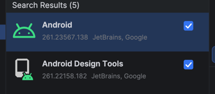

# Android Birthday Party

The goal of this project is to provide an introduction to Kotlin, Android, and Jetpack Compose
fundamentals to prepare for an intro to ATAK plugin development later in the week.

**Scenario:**

Your client is hosting a birthday party and wants to invite all their friends on their off-grid
mesh network. They need a way send out birthday invitations and keep track of who will be coming to
the party.

## Resources

### Docs you'll spend a lot of time in
- [Kotlin Docs](https://kotlinlang.org/docs/home.html)
- [Android Docs](https://developer.android.com/develop)
- [Jetpack Compose Docs](https://developer.android.com/develop/ui/compose/documentation)

### Architecture:
- [Android Architecture](https://developer.android.com/topic/architecture)
- [Android's Architecture Recommendations](https://developer.android.com/topic/architecture/recommendations)

### Testing:
- [JUnit4 for Android](https://developer.android.com/training/testing/local-tests)
- [Mockk - Kotlin Mocking Library](https://mockk.io/)

## Getting Started

- If running in IntelliJ, make sure you install the Android and Android Design Tools plugins.

- Setup emulator

- Open the [user stories](./docs/USER_STORIES.md) file